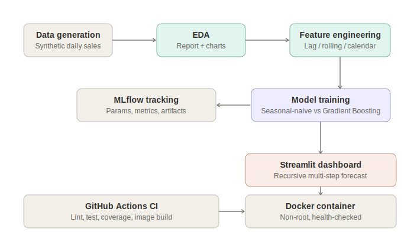

# Retail Demand Forecasting Platform

[](.github/workflows/ci.yml)
[](https://www.python.org/)
[](https://streamlit.io/)
[](https://mlflow.org/)
[](Dockerfile)
[](LICENSE)
[](tests/test_pipeline.py)

An end-to-end SKU-level demand forecasting platform — from synthetic data generation and EDA, through leakage-safe lag/rolling feature engineering, a gradient-boosted model benchmarked honestly against a seasonal-naive baseline, to an interactive Streamlit dashboard doing real recursive multi-step forecasting.

---

## Table of contents

- [Business problem](#business-problem)
- [A note on the dataset](#a-note-on-the-dataset)
- [Architecture](#architecture)
- [Project structure](#project-structure)
- [Exploratory data analysis](#exploratory-data-analysis)
- [Feature engineering — the leakage trap](#feature-engineering--the-leakage-trap)
- [Modeling approach & results](#modeling-approach--results)
- [Recursive forecasting — the multi-step trap](#recursive-forecasting--the-multi-step-trap)
- [Dashboard](#dashboard)
- [Installation & usage](#installation--usage)
- [Testing & code quality](#testing--code-quality)
- [Deployment](#deployment)
- [What's verified vs. what's scaffolded](#whats-verified-vs-whats-scaffolded)
- [Future work](#future-work)
- [License](#license)
- [Contact](#contact)

---

## Business problem

**Getting inventory wrong is expensive in both directions**: overstocking drives markdowns, waste (especially perishables), and holding costs; understocking drives empty shelves and lost sales. SKU-level demand forecasting is the input every downstream decision — purchasing, staffing, promotions — depends on.

**Who faces this:** grocery and retail chains, e-commerce platforms, CPG manufacturers, and supply-chain planning teams at any company holding physical inventory.

**Current industry approaches:**
- Simple moving-average / seasonal-naive baselines — cheap, surprisingly hard to beat casually, and still common in practice
- Classical statistical models (ARIMA, exponential smoothing) — solid for single series, awkward at scale across thousands of SKU/store combinations
- Gradient-boosted trees on lag/calendar features — now the industry-standard middle ground (this is the approach used in published Walmart/Instacart/Kaggle-M5-winning solutions) because one model handles many series at once and easily incorporates promotions, price, and holidays as features

**This project's approach:** exactly that industry-standard path — and the model is only credited with value it actually earns, benchmarked against a seasonal-naive baseline rather than reported in isolation.

## A note on the dataset

**This dataset is synthetic, stated plainly rather than hidden.** The build environment couldn't reach Kaggle (e.g. the "Store Item Demand Forecasting" or M5 competition datasets) or the UCI repository, so [`src/data/generate_data.py`](src/data/generate_data.py) generates 2 years of daily sales across 5 stores × 10 items instead, built from well-documented retail patterns rather than arbitrary numbers:
- Weekly seasonality (weekend lift), annual seasonality (category-dependent amplitude), a slow upward trend
- Fixed-date holiday effects (spikes around Christmas Eve/New Year, a genuine drop on Christmas Day itself)
- Random promotion days with realistic 30–70% sales lift and a coincident price discount
- Small day-to-day price drift

If you have a real dataset (e.g. the Kaggle M5 or Store Item Demand competitions), the same `src/features` → `src/models` pipeline runs on it directly with matching or renamed columns (`date`, `store_id`, `item_id`, `units_sold`, `price`, `is_promo`).

## Architecture



Pipeline: synthetic sales data → EDA → leakage-safe feature engineering → model comparison (tracked in MLflow) → best model persisted → served through an interactive Streamlit dashboard doing recursive multi-step forecasting → containerized with Docker → validated by GitHub Actions CI on every push.

## Project structure

```
retail-demand-forecasting/
├── src/
│   ├── data/
│   │   ├── generate_data.py      # Synthetic daily sales generator
│   │   └── eda.py                # Profiling, charts, markdown report
│   ├── features/
│   │   └── build_features.py     # Leakage-safe lag/rolling/calendar features
│   ├── models/
│   │   ├── train.py               # Chronological split, baseline vs GBR, MLflow
│   │   └── forecast.py            # Recursive multi-step forecasting logic
│   └── app/
│       └── dashboard.py           # Streamlit interactive forecasting UI
├── tests/
│   └── test_pipeline.py           # 14 unit + integration tests
├── configs/config.yaml
├── docs/
│   ├── architecture.svg
│   └── eda_report.md              # Auto-generated by src/data/eda.py
├── assets/                        # Auto-generated charts
├── data/{raw,processed}/          # Generated locally, not committed
├── models_store/                  # Trained model artifact, not committed
├── .github/workflows/ci.yml
├── Dockerfile
├── docker-compose.yml
├── Makefile
├── requirements.txt / requirements-dev.txt
└── pyproject.toml
```

## Exploratory data analysis

Full auto-generated report: [`docs/eda_report.md`](docs/eda_report.md). Headline findings from a 730-day run:

| Finding | Value |
|---|---|
| Total rows | 36,500 (730 days × 5 stores × 10 items) |
| Weekend vs. weekday demand | 133.8 vs. 114.0 avg units/row (+17%) |
| Promotion lift | **+49.7%** average sales lift on promo days |
| Holiday shift | **+15.6%** average (mix of spikes and the Christmas Day drop) |
| Highest-volume categories | produce (165.1), bakery (157.4) avg units/row |


## Feature engineering — the leakage trap

The single most common bug in time-series forecasting pipelines is a lag or rolling feature that accidentally includes the day it's trying to predict. This pipeline guards against it explicitly:

- **`lag_N` features** are computed with `groupby(...).shift(N)` — `lag_1` for day T is verified by test to equal the *actual* `units_sold` on day T−1, nothing else.
- **`rolling_mean_7` / `rolling_mean_28`** are computed on the series *shifted by 1 first*, so the window for day T covers `[T-window, T-1]` and never includes day T's own value — verified by a dedicated test that manually recomputes the expected window.
- **Warm-up rows are dropped**, not zero-filled: the first `max(lag, rolling_window)` days of each store/item series don't have enough history to produce a real feature, so they're excluded from both training and evaluation rather than silently corrupted with placeholder zeros.

## Modeling approach & results

- **Chronological split**: last 60 days held out as test, never shuffled.
- **Seasonal-naive baseline** (predict = same weekday last week, via `lag_7`) computed and reported — a forecasting result without this comparison is not trustworthy on its own.
- **Gradient Boosting Regressor** on lag/rolling/calendar/price/promo features, categorical encoding (store, item, category) via `OrdinalEncoder`.
- **Metrics**: MAE, RMSE, MAPE (excluding zero-actual rows, where it's undefined), and WAPE (more robust than MAPE under near-zero-demand days).

Actual output from a real training run (see [`models_store/model_metadata.json`](models_store/model_metadata.json) after running the pipeline):

| Model | MAE | RMSE | MAPE | WAPE |
|---|---|---|---|---|
| Seasonal-naive baseline | 22.94 | 38.32 | 27.25% | 22.57% |
| **Gradient Boosting (selected)** | **12.63** | **21.62** | **14.12%** | **12.43%** |

**→ 44.9% reduction in WAPE versus the baseline** — a real, honestly-benchmarked improvement, not an inflated headline number with no point of comparison.

## Recursive forecasting — the multi-step trap

Lag/rolling features depend on *actual* past sales. Naively forecasting 30 days ahead "using only known history" silently breaks down past the `lag_1` horizon, because days 2–30 don't have real `lag_1`/`lag_7` values yet. [`src/models/forecast.py`](src/models/forecast.py) implements this correctly: each day's prediction is fed back into the series so the next day's lag/rolling features are computed from it — genuine recursive forecasting, not a shortcut. This is covered by a dedicated test (`test_recursive_forecast_produces_correct_horizon_length`) and was manually verified to reproduce sensible weekly seasonality across a 14-day horizon during development.

## Dashboard

The Streamlit app (`src/app/dashboard.py`) lets you:
- Pick any store/item combination
- Choose a forecast horizon (7–60 days)
- Optionally simulate a promotion running through the forecast window
- See historical vs. forecasted demand on one chart, plus the model's benchmarked accuracy metrics

## Installation & usage

```bash
git clone <YOUR_GITHUB_URL>.git
cd retail-demand-forecasting

python -m venv .venv && source .venv/bin/activate
make install

# Run the full pipeline: generate data -> EDA -> features -> train
make pipeline

# Launch the dashboard
make serve
# -> http://localhost:8501
```

Or step by step:
```bash
python -m src.data.generate_data --n-days 730 --n-stores 5 --n-items 10
python -m src.data.eda
python -m src.features.build_features
python -m src.models.train
streamlit run src/app/dashboard.py
```

### Via Docker

```bash
make pipeline          # train a model first — the image bakes it in
docker compose up --build
```

## Testing & code quality

```bash
make test    # pytest, 14 tests: data integrity, leakage checks, forecast correctness
make lint    # ruff + black --check
```

All 14 tests pass locally, including the leakage-guard tests described above and a forecast-horizon correctness check. `ruff` and `black` are both clean.

## Deployment

Packaged as a standard multi-stage Docker image (non-root user, health check against Streamlit's `/_stcore/health` endpoint) with a matching `docker-compose.yml` that also runs an MLflow UI container. `.github/workflows/ci.yml` lints, tests, and builds the image on every push. The image deploys as-is to Render, Railway, AWS App Runner/ECS, Azure Container Apps, or Google Cloud Run.

## What's verified vs. what's scaffolded

**Actually run and verified during development:**
- Data generation, EDA, feature engineering (including the leakage checks above), model training, and the recursive forecasting function all executed successfully with real output shown above
- The Streamlit app was started and responded to a request in this environment
- All 14 automated tests pass; `ruff`/`black` both pass clean

**Included as production-standard scaffolding, not executed live during development** (no Docker daemon or CI runner in the build sandbox):
- `Dockerfile` / `docker-compose.yml` — standard multi-stage, non-root, health-checked conventions, not build-tested here. Run `docker build .` yourself before relying on it.
- `.github/workflows/ci.yml` — will genuinely lint/test/build-pass on GitHub given the local results above, but hasn't executed on an actual runner yet.
- The Streamlit dashboard's interactive widgets weren't exercised through a real browser session (only the underlying forecasting logic they call was directly tested) — worth a manual click-through before a demo.

## Future work

- Swap in a real dataset (Kaggle M5 / Store Item Demand) once accessible, and re-validate all metrics
- Add prediction intervals (quantile regression) instead of point forecasts, for safety-stock planning
- Add hierarchical reconciliation across store/category/total levels
- Add data/model versioning (DVC) and a proper MLflow model registry stage
- Add Kubernetes manifests and Terraform once a target cloud is chosen

## License

MIT — see [LICENSE](LICENSE).

## Contact

**Muhammad Farooq Shafi**
Email: mfarooqsgafee333@gmail.com
LinkedIn: https://www.linkedin.com/in/muhammadfarooqshafi/
GitHub: https://github.com/Muhammad-Farooq13
Facebook: https://www.facebook.com/profile.php?id=61575167257313
