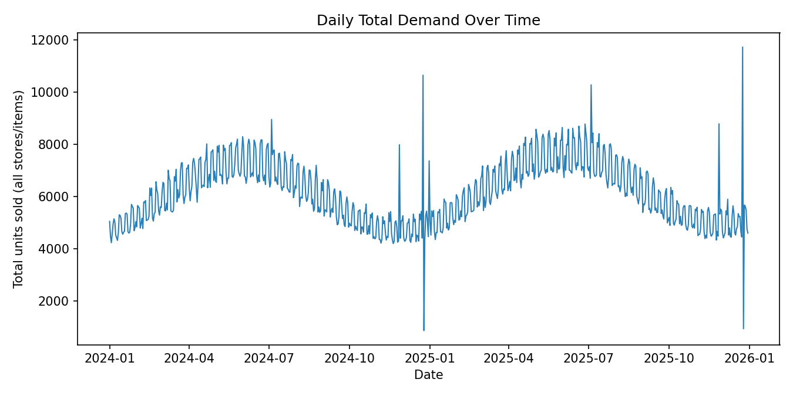
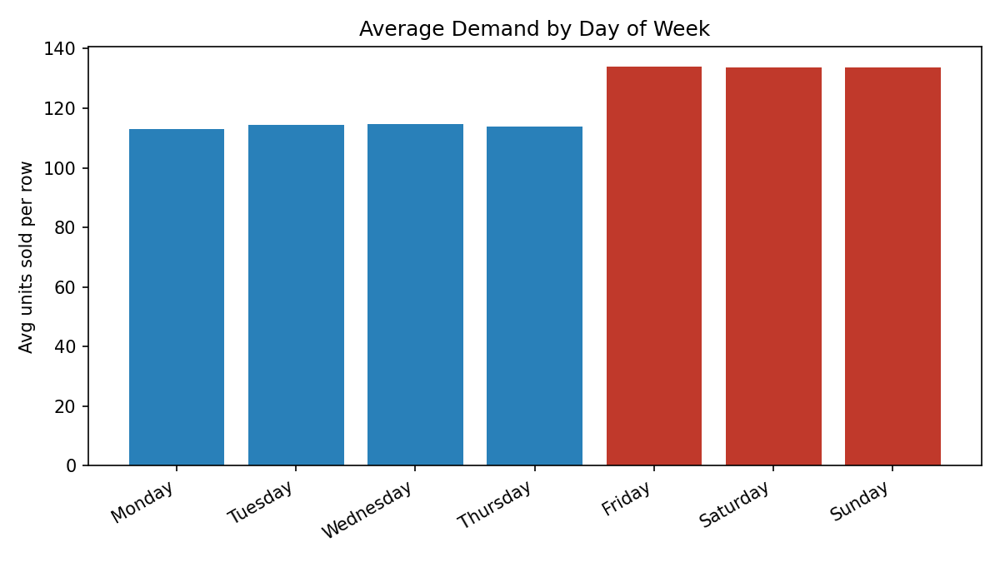
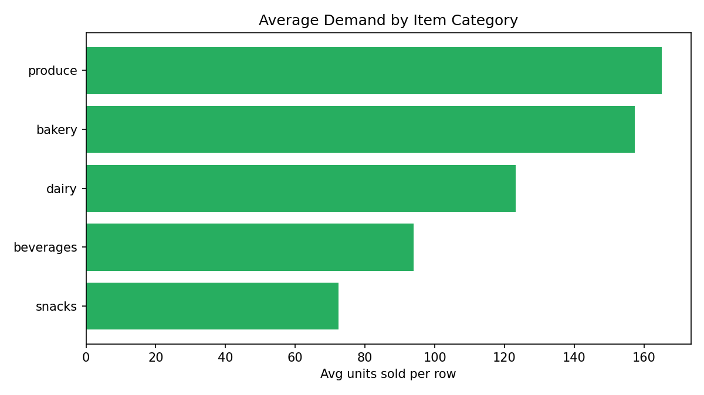

# Exploratory Data Analysis Report

> Auto-generated by `src/data/eda.py`. Dataset is synthetic (see data provenance note in `src/data/generate_data.py`) but modeled on realistic retail seasonality patterns.

## Dataset Overview
- Rows: **36,500** (730 days x 5 stores x 10 items)
- Date range: **2024-01-01** to **2025-12-30**
- Missing values: **0**
- Total units sold: **4,468,963**
- Average daily total demand: **6,121.9** units/day

## Key Findings
1. **Weekend effect is real**: weekday avg 114.0 units/row vs weekend avg 133.8 units/row.
2. **Promotions lift sales by 49.7%** on average (8.01% of rows are promo days) — this must be a model feature, not left as unexplained variance.
3. **Holidays shift demand by 15.6%** on average (mix of spikes like Christmas Eve and drops like Christmas Day itself).
4. **Category matters** — see `sales_by_category` below; produce and beverages have the highest average unit volume.

## Average Demand by Category
| Category | Avg units/row |
|---|---|
| produce | 165.1 |
| bakery | 157.4 |
| dairy | 123.3 |
| beverages | 94.0 |
| snacks | 72.4 |

## Charts

## Data Quality Checks
- No missing values: PASS
